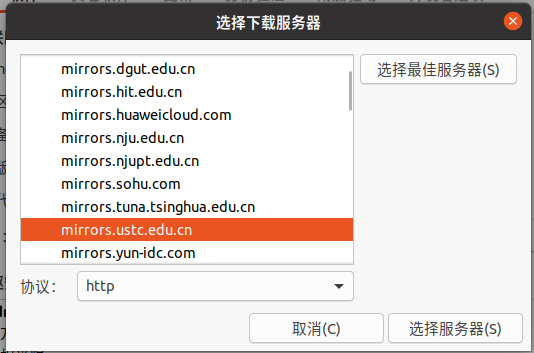
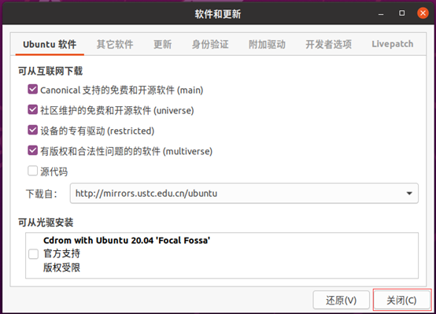
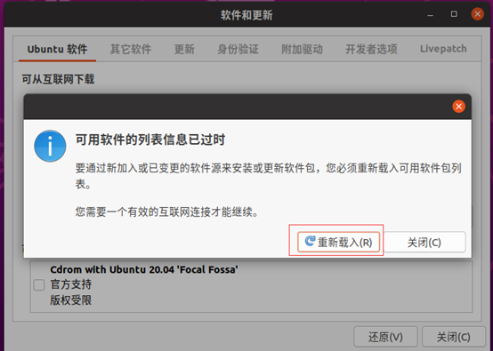
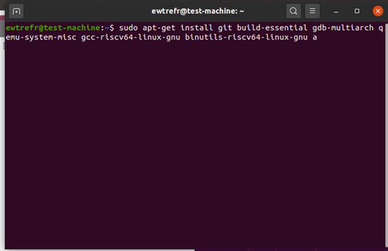
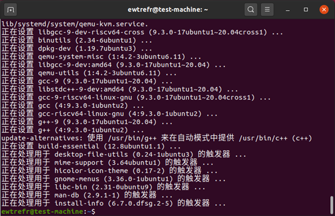
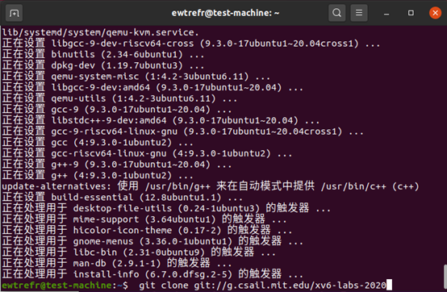
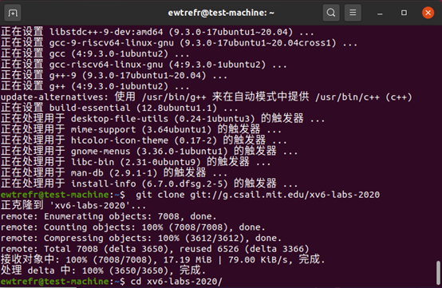
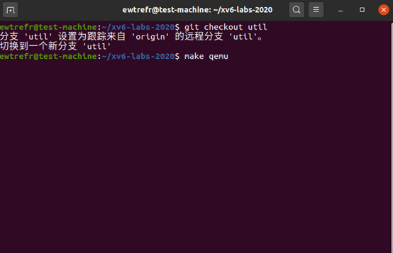
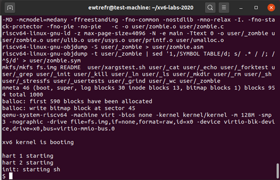

**完美避坑·五分钟搞定一切的XV6环境安装法·傻瓜版**

Pain Is Inevitable; Suffering Is Optional

基于前人的教训，本帖是堪称手把手教你安装XV6环境的傻瓜级教程。你只需要严格按照我们列出的步骤一步步安装即可，如果你的网速在线，不是村里刚通那种，一共只需花费五分钟，工欲善其事必先利其器，我们开始吧。

1. 准备阶段

   你需要一台安装了Ubuntu20的电脑或者虚拟机，如果你已经安装了Ubuntu但是版本比较低，还请你升级到Ubuntu20,或者直接重装一个虚拟机也并不麻烦，下载地址如下：

   https://ubuntu.com/download/desktop

   安装好Ubuntu20后，我们还需要换源，这一步必不可少。

   如图所示，搜索software，打开搜索结果中的软件与更新

   

   点击其他站点

   

   在 选择下载服务器中mirrors.ustc.edu.cn

   

   关闭 软件与更新

   

   在关闭时弹出的对话框中选择 重新载入

   

   至此，我们便完成了准备阶段的工作，这一步完成了之后剩下的就很简单了。

2. 正式安装

   打开终端，键入命令：

   ```
   sudo apt-get install git build-essential gdb-multiarch qemu-system-misc gcc-riscv64-linux-gnu binutils-riscv64-linux-gnu
   ```

   

   耐心等待（用自己网的同学如果发现下载速度太慢可以挂校园网VPN）直到出现如下界面

   

   键入命令：

   ```
   git clone git://g.csail.mit.edu/xv6-labs-2020
   ```

   

3. 完成与测试

   接上图，耐心等待直到其执行完毕后，键入命令：

   ```
   cd xv6-labs-2020/
   ```

   

   我们来试试打开第一个lab，键入命令:

   ```
   git check util
   ```

   再键入命令:

   ```
   make qemu 
   ```

   

   如若出现以下界面，便说明我们大功告成啦，我们还顺带完成了lab1的第一部分内容.

   

   至此，XV6环境安装全部完成。请尽情享受 xv6 lab的热情款待（虐待）吧。

